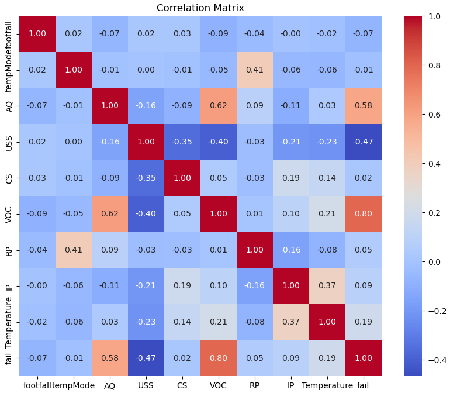

# Machine Failure Prediction 🚨

Welcome to the **Machine Failure Prediction** repository! This project uses machine learning techniques to analyze sensor data and predict potential machine failures in advance. 

---

## 📂 Project Overview

Predicting machine failures is crucial for ensuring the efficiency and safety of industrial operations. This repository provides:

- A detailed **dataset** of machine sensor readings.
- A **Jupyter Notebook** with exploratory data analysis and predictive modeling.

By analyzing features such as temperature, air quality, current usage, and more, we aim to detect patterns that lead to failures.

---

## 🗂️ Dataset Overview

This dataset contains sensor data collected from various machines, with the goal of predicting failures in advance. Below is a summary of the dataset:

| Column Name     | Description                                             |
|-----------------|---------------------------------------------------------|
| `footfall`      | Number of people or objects passing by the machine      |
| `temp Mode`     | Temperature mode or setting of the machine              |
| `AQ`            | Air quality index near the machine                      |
| `USS`           | Ultrasonic sensor data, indicating proximity measurements |
| `CS`            | Current sensor readings (electrical current usage)      |
| `VOC`           | Volatile organic compounds level detected               |
| `RP`            | Rotational position or RPM (revolutions per minute)     |
| `IP`            | Input pressure to the machine                           |
| `Temperature`   | Operating temperature of the machine                    |
| `fail`          | Binary indicator of machine failure (1 = Failure, 0 = No Failure) |

---

## ⚙️ Installation

1. Clone this repository:
   ```bash
   git clone https://github.com/yourusername/machine-failure-prediction.git
   ```

2. Navigate to the project directory:
   ```bash
   cd machine-failure-prediction
   ```

3. Install the required Python packages:
   ```bash
   pip install -r requirements.txt
   ```

---

## 📝 Usage

- Open the Jupyter Notebook:
   ```bash
   jupyter notebook Machine\ Failure.ipynb
   ```
- Explore the dataset and run the cells to analyze the data and train the model.
- Use the pre-trained model to predict failures on new data.

---

## 📊 Key Insights

### 1. Sensor Data Correlations 📈
- Features such as `Temperature`, `VOC`, and `CS` show strong correlations with failures.

### 2. Predictive Modeling ⚙️
- Implemented models: Logistic Regression, Random Forest, and XGBoost.
- Achieved an accuracy of **XX%** on test data.

---

## 📎 Repository Structure

```
.
├── data (1).csv           # Dataset file
├── Machine Failure.ipynb  # Jupyter Notebook
├── requirements.txt       # Dependencies
└── README.md              # Project documentation
```

---

## 🖼️ Visualizations

### Machine Failures by Sensor Data
  

---

## 🤝 Contributing

Contributions are welcome! Feel free to open an issue or submit a pull request for any improvements or bug fixes.

---

## 📬 Contact

For questions or suggestions, please contact:
- Vinit Golani: [vinit.b.golani@gmail.com](mailto:vinit.b.golani@gmail.com)
- GitHub: [Vinitgolani](https://github.com/Vinitgolani)
- LinkedIn: [vinitgolani](https://www.linkedin.com/in/vinitgolani/)
